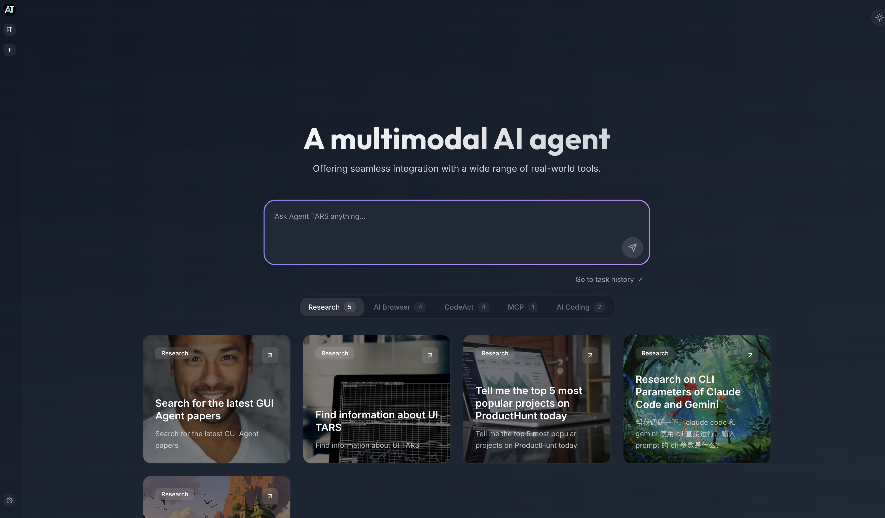
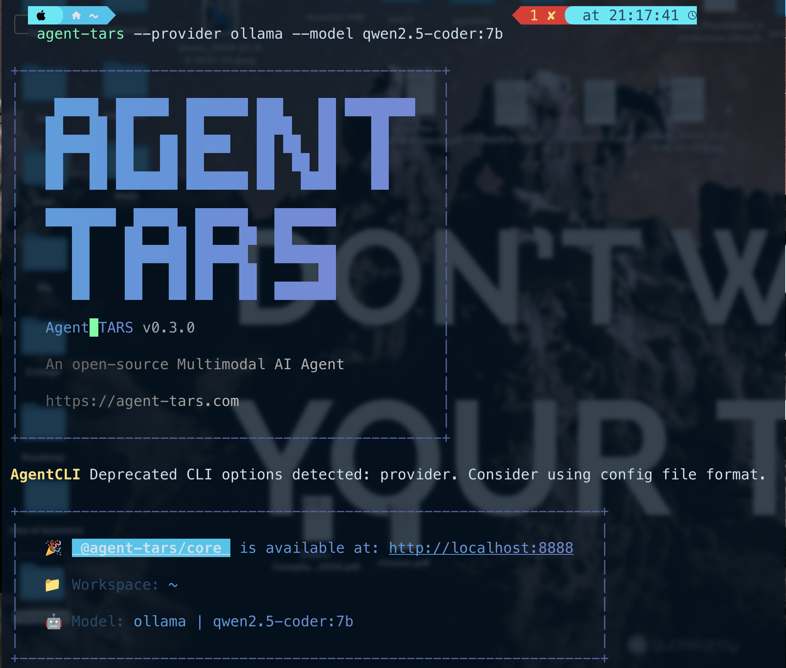

# local-ai-desktop-agent
# 🖥️ Ollama + UI-TARS Desktop Agent (macOS)

<p align="center">
  <b>Run a powerful Desktop AI Agent fully locally on macOS</b><br>
  <i>No Cloud • No OpenAI • Full Privacy</i>
</p>

---

## 🚀 Overview

This repository documents how to run **UI-TARS Desktop** (by ByteDance) locally on **macOS**
using **Ollama** as the LLM backend.

Instead of using the OpenAI API, UI-TARS is connected to a **local Ollama model**
via an OpenAI-compatible endpoint.

> ⚠️ This project focuses on **installation, configuration, and macOS security setup**.  
> UI-TARS itself is developed and maintained by ByteDance.

---

## 🧠 Model & Runtime

| Component | Value |
|--------|------|
| LLM Runtime | Ollama |
| Model | `qwen2.5-coder:7b` |
| Mode | Fully Local / Offline |
| OS | macOS |

---

## ✨ Key Features

- ✅ Fully local AI agent
- ✅ No cloud / no API cost
- ✅ Desktop UI automation
- ✅ OpenAI-compatible API via Ollama
- ✅ macOS security-aware setup
- ✅ Privacy-first execution

---

## 🖼️ Demo

### 🧩 UI-TARS Desktop Interface
<p align="center">
  
</p>

### 🖥️ Running from Terminal
<p align="center">
  
</p>

---

## 📦 Requirements

- macOS
- Ollama (official installer)
  - https://ollama.com
- UI-TARS Desktop
  - https://github.com/bytedance/UI-TARS-desktop

---

## ⚙️ Installation & Setup

### 1️⃣ Install Ollama

Download and install Ollama from the official website:

```bash
https://ollama.com
```
Pull the model:

ollama pull qwen2.5-coder:7b


Start Ollama:
```
ollama serve
```

Ollama API will be available at:

http://localhost:11434

2️⃣ Install UI-TARS Desktop

Clone the official repository:
```
git clone https://github.com/bytedance/UI-TARS-desktop.git
cd UI-TARS-desktop
```

Follow the official instructions in their README to complete installation.

3️⃣ Connect UI-TARS to Ollama (Important)

UI-TARS expects an OpenAI-style API by default.
Use the command below to redirect it to local Ollama:
```
agent-tars \
  --provider openai \
  --baseUrl http://localhost:11434/v1 \
  --model qwen2.5-coder:7b \
  --apiKey ollama
```

🔎 Notes:

provider openai → required by UI-TARS

baseUrl → local Ollama endpoint

apiKey → dummy value (required but not used)

## 🍎 macOS Security Configuration

macOS blocks **GUI automation** by default.  
To allow UI-TARS to control the desktop, specific permissions **must be granted manually**.

### 📄 Configuration File
This repository includes:

```text
config/macos-security.yaml
```
⚙️ Required Permissions

Open:

System Settings → Privacy & Security

Then enable the following:

🧩 Accessibility

🎥 Screen Recording

🤖 Automation

📂 Full Disk Access (optional, but recommended)

❗ Without these permissions, UI-TARS cannot interact with the desktop UI.

###📁 Repository Structure

```
Ollama-ui-agent-macos/
├── config/
│   └── macos-security.yaml
├── images/
│   ├── UI-interface.png
│   └── Terminal.png
└── README.md
```
🔐 Privacy & Offline Mode

🚫 No OpenAI API calls

☁️ No cloud dependency

🔒 All inference runs locally

🧠 Full control over the model and data

<p align="center"> <b>Privacy-first. Offline-ready. Fully local AI.</b> 🚀 </p> 
